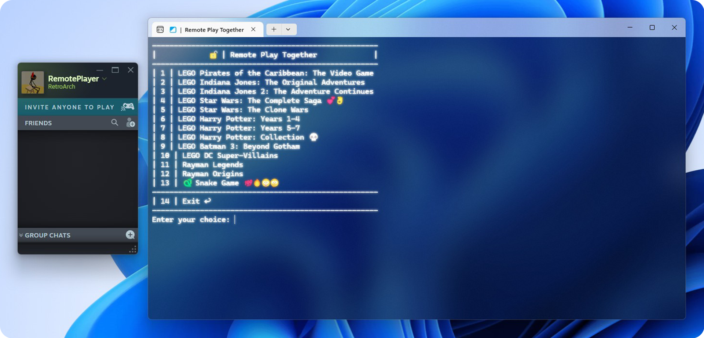

# Remote Play Together for non-Steam games

This small **program** lets you use **Steam Remote Play Together** with **any game** on your PC.

## Preview



## Setup

1. Compile `Source.cpp` *(x64)* or use the precompiled `RemotePlayTogether.exe` from the [Releases](https://github.com/Counter-clock/Remote-Play-Together-for-nonSteam-games/releases) section.
2. Download any game from Steam that supports Remote Play Together.
   
   Recommended: [RetroArch](https://store.steampowered.com/app/1118310/RetroArch/)  - *free, small, controller support for remote play*
   
4. Go into the game's directory: Right-click → Properties → Installed Files → Browse
5. Find the game's main executable. For example: `retroarch.exe`
6. Replace the game's main executable with this program. You can also remove the game files for clarity.
8. Launch the game from your Steam library, this creates a `remoteplay.txt` file in the program's directory.
10. Add all your game `.exe` file paths into `remoteplay.txt`, one path per line.
11. Press any key to refresh the program, then pick your game from the newly displayed menu.
12. Once your chosen game has started, open **Steam Overlay**, go to **Remote Play Together** and **invite your friend**.

### Example of `remoteplay.txt`:  

```txt
D:\Games\VideoGame1\videogame1.exe
D:\Games\VideoGame2\videogame2.exe
C:\SteamLibrary\steamapps\common\VideoGame3\videogame3.exe | Video Game 3
C:\SteamLibrary\steamapps\common\VideoGame4\videogame4.exe | Game 4
C:\EpicGames\VideoGame5\videogame5.exe | Custom Name
```  
> **TIP**: By adding `|` at the end of a line, you can set a custom name that will be displayed in the menu.

## Windows

The program temporarily changes the appearance of your Windows Terminal to match the style shown in the screenshot.  
  
By default, Windows Terminal is preinstalled on Windows 11. If you're using Windows 10 and want to use this functionality, you can download Windows Terminal from the [Microsoft Store](https://apps.microsoft.com/detail/9n0dx20hk701).